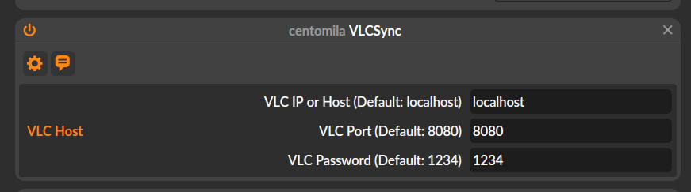

### What is VLCSync?

**VLCSync** is an extension that synchronizes VLC Media Player playback with Bitwig Studio. **You can send the start/pause/seek commands to VLC from Bitwig Studio.**

#### Limitations

- VLC Media Player only accept rounds seconds.

This was my initial attempt at syncing a media player with Bitwig Studio. Although functional, this project is now deprecated in favor of...

### A Better Alternative

For an improved solution, I have rebuilt this project using MTC Synchronization and a web-based video player. Check out [CentoSync](https://github.com/centomila/CentoSync-VideoPlayer-With-MTC-Sync).

---

### Usage

#### Set Up VLC Media Player

1. Download [VLC Media Player](https://www.videolan.org/vlc/).
2. Open VLC Media Player.
3. Navigate to **Tools > Preferences** (<kbd>Ctrl+P</kbd>).
4. In the lower-left corner, select the 🔘 **`All`** radio button under `Show settings`.
5. Expand the `Interface` section:
   - Click `Main Interfaces`.
   - Enable the ✅ **`Web`** checkbox.
6. Under the `Interface` section:
   - Select `Main Interface`.
   - Navigate to `Lua`.
     - Set the `LUA HTTP Password` field to your desired password (default: `1234`).
7. Save your preferences.
8. Restart VLC Media Player and open a video file.

#### Install the Extension

1. Copy the 📄 `VLCSync.bwextension` file to your Bitwig Studio extensions directory:
   - 🪟 **Windows:**  
     `%USERPROFILE%\Documents\Bitwig Studio\Extensions\` or  
     `%USERPROFILE%\OneDrive\Documents\Bitwig Studio\Extensions\`
   - 🍎 **Mac:**  
     `~/Documents/Bitwig Studio/Extensions/`
   - 🐧 **Linux:**  
     `~/Bitwig Studio/Extensions`
2. Open 🟧 **Bitwig Studio**.
3. Go to **Settings**:
   - Navigate to the **Controllers** tab.
   - Click **Add Controller**.
   - Select **Vendor: centomila**.
   - Choose the `VLCSync.bwextension` file from the list.


**Note:** The first time you launch the extension or VLC's remote server, your firewall may prompt you to allow permissions. Port `8080` will need to be opened to enable VLC on your network.



#### Sync the Video Player with Bitwig Studio

---

### Compile the Source

If you want to compile the source code, This project is a Java-based Bitwig Studio extension. It requires **Maven** and the **Java JDK**.

1. Open the `pom.xml` file and locate **line 12**.
2. Update the `bitwig.extensions.dir` path to your Bitwig Studio extensions directory:

   ```xml
   <bitwig.extensions.dir>${env.USERPROFILE}/OneDrive/Documenti/Bitwig Studio/Extensions</bitwig.extensions.dir>
   ```

3. Compile the extension using the `mvn install -f` command. Customize the path to your `pom.xml` file:

   ```pwsh
   mvn install -f "d:\GitHub\Bitwig Extensions\VLCSync\pom.xml"
   ```
